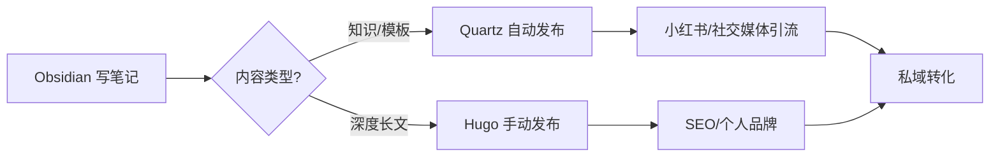

# 混合模式：Quartz + Hugo 打造高效知识工作流

## 为什么选择混合模式？

作为一个 XR 产品经理，我一直在寻找最高效的知识管理和内容发布方式。经过多次尝试，我发现单一的博客系统很难满足所有需求：

- **Hugo**：适合正式博客，SEO 好，但维护成本高
- **Quartz**：适合知识库，与 Obsidian 无缝集成，但主题选择少

于是，我决定采用**混合模式**，发挥两者的优势。

## 混合模式架构

### 内容分类策略

| 内容类型 | 发布平台 | 更新频率 | 目的 |
|----------|----------|----------|------|
| AI 知识库 | Quartz | 每周 2-3 次 | 引流、展示专业度 |
| Prompt 模板 | Quartz | 每周 1-2 次 | 免费内容引流 |
| 深度长文 | Hugo | 每月 1-2 次 | SEO、个人品牌 |
| 产品介绍 | Hugo | 不定期 | 正式发布 |

### 工作流设计



## Quartz 部署步骤

### 1. 克隆 Quartz 仓库

```bash
git clone https://github.com/jackyzha0/quartz.git ~/ai-garden
cd ~/ai-garden
```

### 2. 配置 GitHub Pages

```bash
git init
git remote add origin git@github.com:Igloo302/ai-garden.git
git push -u origin main
```

然后在 GitHub 仓库设置中开启 Pages：
- Settings → Pages → Source: main branch

### 3. 同步 Obsidian 内容

只同步公开内容到 `content/` 目录：

```bash
# 复制 AI 知识库
cp -r ~/Documents/Obsidian/04-Knowledge/AI/* content/

# 复制 Prompt 库（部分）
cp ~/Documents/Obsidian/03-Prompt-Library/按场景分类/写作/*.md content/prompt/
```

### 4. 配置过滤规则

编辑 `quartz.config.ts`：

```typescript
export default {
  filters: {
    exclude: ["**/private/**", "**/drafts/**"],
  },
}
```

## Hugo 维护策略

### 保留现有 Hugo 博客

- 继续使用 `igloo302.github.io`
- 主要发布深度长文和正式内容
- 每月更新 1-2 次即可

### Hugo 内容来源

- 从 Obsidian 导出 Markdown
- 手动调整格式适配 Hugo
- 添加 Hugo 特有的 frontmatter

## 自动化脚本

创建同步脚本 `sync-to-quartz.sh`：

```bash
#!/bin/bash
# 只同步带 publish: true 标签的笔记

cd ~/Documents/Obsidian
grep -rl "publish: true" . | while read file; do
    cp "$file" ~/ai-garden/content/
done

cd ~/ai-garden
git add .
git commit -m "Auto sync from Obsidian"
git push
```

## 效果预览

- **Quartz**: https://igloo302.github.io/ai-garden/
- **Hugo**: https://igloo302.github.io/

## 经验总结

### 优势

1. **降低维护成本**：Quartz 几乎零维护
2. **提高更新频率**：更容易坚持更新
3. **精准内容分发**：不同类型内容用不同平台
4. **互相引流**：两个平台互相推荐

### 注意事项

1. **内容规划**：提前规划哪些内容放哪个平台
2. **格式统一**：保持 Markdown 格式一致性
3. **定期审查**：每月检查一次内容质量
4. **数据追踪**：监控两个平台的数据表现

## 下一步计划

- [ ] 完善 Quartz 主题定制
- [ ] 创建更多免费 Prompt 模板
- [ ] 建立自动化发布流程
- [ ] 开始知识付费产品开发

通过这种混合模式，我终于找到了可持续的知识管理和内容发布方式。希望对你也有所启发！