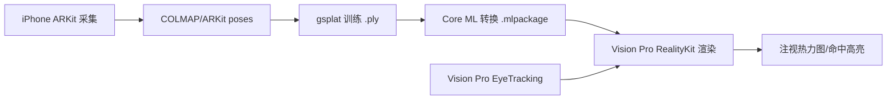

# iOS 26 Spatial Scene + Eye Tracking 研发项目

> **孵化期**：等待 Apple 公开 API 或自研管线跑通
> **优先级**：P1（XR 核心赛道）
> **预计交付**：最小可行 Demo（MVD）在 2026 Q3 前

---

## 🎯 核心目标

构建 **眼动追踪 + 空间场景（3D Gaussian Splatting）** 的端到端 Demo：
- iPhone 端采集：多视角 RGB + LiDAR/TrueDepth 深度 + 眼动注视向量
- 本地/云端训练：3DGS 模型（gsplat + Core ML 部署）
- Vision Pro 端渲染：RealityKit 高斯球光栅化 + 实时注视热力图/命中交互

---

## 📦 现状快照（2026-07-11）

| 层级 | 现状 | 备注 |
|------|------|------|
| **系统能力** | iOS 26 Spatial Scene 仅 Photos App 内部可用，无公开 API | WWDC25 Session 317/287 未提及创建接口 |
| **眼动追踪** | iOS：仅前置 TrueDepth（ARFaceAnchor），无公开原始数据导出 visionOS 26+：`EyeTrackingProvider` 公开，但数据不出设备 | 双设备协作方案可行 |
| **3DGS 生态** | `nerfstudio-project/gsplat` (CUDA) → Core ML 转换成熟 `Polycam`/`KIRI` 等商业 App 已跑通移动端推理 | 自研管线技术风险可控 |
| **开发设备** | iPhone 15 Pro + Vision Pro（已有） | 可直接起跑 |

---

## 🛠 技术路线图

### Phase 0：调研与决策（本周）
- [ ] 确认 iOS 26 Beta 3+ 私有符号表（`SpatialScene`、`PHAsset.spatialSceneRepresentation`）
- [ ] 提交 Feedback (FB) 要求开放 Spatial Scene 创建/读取 API
- [ ] 对比「自研管线」vs「等公开 API」ROI，定 Go/No-Go

### Phase 1：自研最小管线（2 周）

**关键任务**
- [ ] `ARWorldTrackingConfiguration` + `sceneDepth` + `semanticSegmentation` 采集脚本
- [ ] `ns-process-data` → `ns-train splatfacto` 跑通单场景
- [ ] `gsplat` 导出 PLY → `coremltools` 转 `MLModel`（量化 FP16/INT8）
- [ ] RealityKit `CustomMesh` + `ShaderGraphMaterial` 实现高斯球光栅化
- [ ] `EyeTrackingProvider` 注视射线 → 世界坐标系 → 与高斯球 AABB 相交测试

### Phase 2：产品化封装（4 周）
- [ ] iOS App：一键采集 → 进度条 → 推送到 Vision Pro
- [ ] Vision Pro App：场景库 + 注视交互模式（凝视选中/停留触发/热力图回放）
- [ ] 云端训练可选项（大场景/长视频）
- [ ] 导出标准格式（PLY/3D Tiles/glTF）供下游使用

### Phase 3：探索系统级集成（长期）
- [ ] 若 iOS 26.1+ 开放 `SpatialScene` API，迁移至系统管线
- [ ] 接入 `ARKit` 实时场景理解（Plane/Object/Room Anchor）增强语义
- [ ] 多用户共享空间场景（SharePlay + 空间锚点）

---

## 🧩 关键技术债与风险

| 风险 | 缓解措施 |
|------|----------|
| iOS 端无眼动原始数据 | 方案 A：Vision Pro 端采集眼动 + iPhone 端采集场景，NTP/PTP 时间同步 方案 B：仅做 Vision Pro 单机闭环（采集+训练+渲染+眼动） |
| 3DGS 移动端显存/功耗 | `gsplat` 已支持稀疏更新 + 视锥剔除；Core ML 量化至 4-bit 可行 |
| 空间场景版权/隐私 | 仅本地处理，不上传；导出文件加密可选 |
| Apple 后续推出原生 API 覆盖 | 设计插件化架构：`SpatialSceneProvider` 协议，系统实现/自研实现热插拔 |

---

## 📂 资源链接

### 官方文档
- [Creating spatial photos and videos with spatial metadata](https://developer.apple.com/documentation/imageio/creating-spatial-photos-and-videos-with-spatial-metadata)
- [RealityKit Scene Understanding](https://developer.apple.com/documentation/realitykit/realitykit-scene-understanding)
- [visionOS 26 Release Notes](https://developer.apple.com/documentation/visionos/release-notes)

### 开源栈
- [gsplat](https://github.com/nerfstudio-project/gsplat) — CUDA 光栅化器 + Python 绑定
- [nerfstudio](https://github.com/nerfstudio-project/nerfstudio) — 训练管线（`splatfacto`）
- [ARKitScenes](https://github.com/apple/ARKitScenes) — 最大公开 RGB-D 数据集
- [kyle-fox/ios-eye-tracking](https://github.com/kyle-fox/ios-eye-tracking) — ARFaceAnchor 封装
- [shu223/visionOS-Sampler](https://github.com/shu223/visionOS-Sampler) — visionOS 样例合集

### WWDC Sessions
- WWDC25 Session 287: What's new in RealityKit
- WWDC25 Session 317: What's new in visionOS 26
- WWDC24 Session 10166: Build compelling spatial photo and video experiences
- WWDC24 Session 10100: Create enhanced spatial computing experiences with ARKit

### 社区讨论
- [Reddit: How does iOS 26 Spatial scene work?](https://www.reddit.com/r/apple/comments/1nmosor/)
- [Apple Dev Forums: Spatial Scene API request](https://developer.apple.com/forums/tags/realitykit) — 搜 `SpatialScene` `PHAsset spatialScene`

---

## 🗓 里程碑

| 日期 | 里程碑 | 验收标准 |
|------|--------|----------|
| 2026-07-18 | Phase 0 决策 | Go/No-Go 文档 + FB 编号 |
| 2026-08-01 | Phase 1 MVD | Vision Pro 上能看自研 60 FPS 渲染自采集场景，注视点实时高亮 |
| 2026-09-01 | Phase 2 Alpha | 双端 App 可安装、基本交互闭环 |
| 2026-10-15 | Phase 2 Beta | 性能达标（< 40% GPU、< 2W）、导出标准格式 |
| 2026-WWDC26 | Phase 3 启动 | 若系统 API 开放，完成迁移 Spike |

---

## 💡 灵感/备忘

- **场景化 Demo**：自家客厅扫描 → 注视沙发标签弹出价格/购买链接（电商）、注视墙面弹出装修预览（家装）
- **数据资产**：自建「空间场景数据集」→ 后续可做语义分割/实例分割/布局生成微调
- **商业化切口**：B 端「空间化产品展示」、C 端「记忆相册 3.0」、教育「实验场景复现」

---

## 🔗 关联文档

- [[XR Research Roadmap]] — 总体技术雷达
- [[Vision Pro Dev Environment Setup]] — 环境配置清单
- [[Core ML Model Deployment Checklist]] — 部署规范
- [[Privacy & Data Compliance for Spatial Apps]] — 合规清单

---

> **下一步行动**（2026-07-11 晚）：
> 1. 在 iPhone 15 Pro 装 iOS 26 Beta 3，跑一次 `PHAsset` 私有属性枚举
> 2. 提交 FB（Feedback Assistant）要求开放 `SpatialScene` 读写 API
> 3. 克隆 `gsplat` + `nerfstudio`，跑通 `splatfacto` 单场景训练